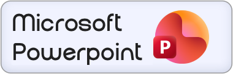

# slides-capture

Captures every slide in a presentation as a numbered screenshot — no API, no browser extension, no faff. Just Python talking to your screen.

Works with anything you can put into fullscreen: Google Slides, PowerPoint, Keynote, LibreOffice, PDF decks.

## Supports

<p align="left">
  
  &nbsp;&nbsp;
  
</p>

---

## How it works

There are two modes depending on whether you're the one presenting or just watching.

**`auto`** — The script drives the deck for you. It takes a screenshot, presses the right arrow, waits, and repeats until it detects the end of the deck (two consecutive frames that look identical). Good for exporting your own deck when you have full keyboard control.

**`watch`** — You sit back and the script watches the screen. It samples the display several times per second using a perceptual hash, and the moment a real slide change happens it waits for any transition to finish and then saves a screenshot. Good for recording a live presentation or screenshare where you can't drive the slides yourself.

---

## Requirements

Python 3.10 or later.

```bash
pip install pyautogui pillow keyboard imagehash
```

> **macOS** — Terminal (or whichever app you run the script from) needs Accessibility and Screen Recording permissions. Go to System Settings → Privacy & Security and enable both for your terminal app.

> **Linux** — The `keyboard` library needs elevated permissions to listen for global keypresses. Either run with `sudo`, or add yourself to the `input` group (`sudo usermod -aG input $USER`) and log out and back in.

---

## Installation

```bash
git clone https://github.com/your-username/slides-capture.git
cd slides-capture
pip install pyautogui pillow keyboard imagehash
```

`config.json` is already in the repo. Edit it before your first run — at minimum set `session_name` and `mode`.

---

## Usage

**Auto mode**

1. Put your presentation into fullscreen (`F5` in Google Slides and PowerPoint, `⌘⇧F` in Keynote).
2. Set `"mode": "auto"` in `config.json`.
3. Run `python app.py`.
4. You have a few seconds (configurable via `countdown`) to click into the presentation window — then the script takes over.

**Watch mode**

1. Get the presentation visible and fullscreen.
2. Set `"mode": "watch"` in `config.json`.
3. Run `python app.py`.
4. The script captures the first slide immediately, then monitors quietly. Every real slide change triggers a capture.
5. Press `Q` (or your configured `stop_key`) when done.

**Stopping the script**

- Press the `stop_key` (default `Q`) at any point — it runs in a background thread so it works even while the script is waiting.
- Move your mouse to the top-left corner of the screen — pyautogui's failsafe will kill it immediately.
- `Ctrl+C` in the terminal also works.

---

## Output

Each run creates a timestamped subfolder named after your session:

```
slides_output/
└── morning-standup_20250603_141200/
    ├── morning-standup_001.png
    ├── morning-standup_002.png
    ├── morning-standup_003.png
    └── ...
```

The session name is whatever you set in `config.json`. Spaces become hyphens automatically.

---

## Configuration

Everything is in `config.json`. You never need to edit the Python file.

```json
{
  "session_name": "my-presentation",
  "output_dir":   "slides_output",
  "mode":         "auto",
  "auto": {
    "slide_delay": 0.3,
    "countdown":   5,
    "max_slides":  40
  },
  "watch": {
    "poll_interval":    0.2,
    "change_threshold": 8,
    "settle_delay":     0.3,
    "max_slides":       200
  },
  "image_format": "png",
  "stop_key":     "q"
}
```

### Top-level

| Key | Description |
|---|---|
| `session_name` | Prefix used for the output folder and every screenshot filename. Make it something meaningful — `"q3-review"`, `"onboarding"`. |
| `output_dir` | Root folder for all session subfolders. Relative to the script. |
| `mode` | `"auto"` or `"watch"`. |
| `image_format` | `"png"` or `"jpg"`. PNG is lossless and recommended unless you need smaller files. |
| `stop_key` | Key that aborts the script at any time. Default is `"q"`. Any key name the `keyboard` library understands works — `"esc"`, `"f12"`, etc. |

### `auto` block

| Key | Description |
|---|---|
| `slide_delay` | Seconds to wait after pressing the right arrow before taking the next screenshot. `0.3` is fine for simple decks. If your slides have animations or transitions, increase this to `0.8`–`1.5` so everything finishes rendering before capture. |
| `countdown` | Seconds between starting the script and capture beginning — time to click into the presentation window. |
| `max_slides` | Upper limit on slides captured. The script also stops automatically when end-of-deck is detected, so this is just a safety fallback. Raise it for long decks. |

### `watch` block

| Key | Description |
|---|---|
| `poll_interval` | How often (in seconds) the screen is sampled. `0.2` means five times per second, which is responsive without hammering the CPU. |
| `change_threshold` | How visually different two frames need to be to count as a new slide, measured as a perceptual hash distance. `0–3` is just noise or cursor movement. `4–7` is a transition mid-flight. `8` and above is a real slide change. If animated content is causing false captures, raise this to `10`–`12`. If fast transitions are being missed, lower it slightly. |
| `settle_delay` | Seconds to wait after detecting a change before saving the screenshot. This lets slide transitions finish so you get a clean frame rather than a half-drawn one. Raise to `0.6`–`1.0` for slow or elaborate transitions. |
| `max_slides` | Upper limit on slides captured in a session. |

---

## Function reference

| Function | Description |
|---|---|
| `load_config()` | Reads and parses `config.json` from the same directory as the script. Raises `FileNotFoundError` with a clear message if the file is missing. |
| `countdown(seconds)` | Prints an in-place countdown in the terminal so you have time to click into the fullscreen window before capture starts. |
| `make_output_dir(base, session)` | Creates the timestamped session folder (e.g. `slides_output/morning-standup_20250603_141200/`) and returns its path. |
| `slide_filename(folder, session, index, fmt)` | Builds the full path for a single slide, e.g. `morning-standup_003.png`. |
| `capture(path)` | Takes a full-screen screenshot, saves it to disk, and returns the image alongside its perceptual hash. |
| `phash_distance(a, b)` | Returns the Hamming distance between two perceptual hashes. `0` means identical; higher means more visually different. |
| `run_auto(cfg, output_folder, session)` | Runs auto mode: screenshot, press right arrow, wait, repeat. Stops when end-of-deck is detected or `max_slides` is reached. |
| `run_watch(cfg, output_folder, session)` | Runs watch mode: polls the screen continuously, captures when `phash_distance` exceeds `change_threshold`, waits `settle_delay` before saving. |
| `main()` | Entry point. Loads config, starts the stop-key listener thread, creates the output folder, and hands off to `run_auto` or `run_watch`. |

---

## Troubleshooting

**Slides are being skipped in auto mode** — increase `slide_delay`. At `0.3s` the script might advance before an animated slide has finished rendering.

**Watch mode is triggering too often** — raise `change_threshold`. Animated content or video embeds can look like a slide change at the default setting of `8`. Try `12`–`15`.

**Watch mode is missing transitions** — lower `poll_interval` to `0.1` and slightly reduce `change_threshold`.

**macOS: the keyboard stop key does nothing** — check that your terminal has Accessibility permission in System Settings → Privacy & Security.

**Linux: permission error from `keyboard`** — run with `sudo`, or add yourself to the `input` group and re-login.

---

## Project structure

```
slides-capture/
├── app.py
├── config.json
├── README.md
└── assets/
    ├── slides.png
    └── powerpoint.png
```


## Licence

MIT — do whatever you want with it.
